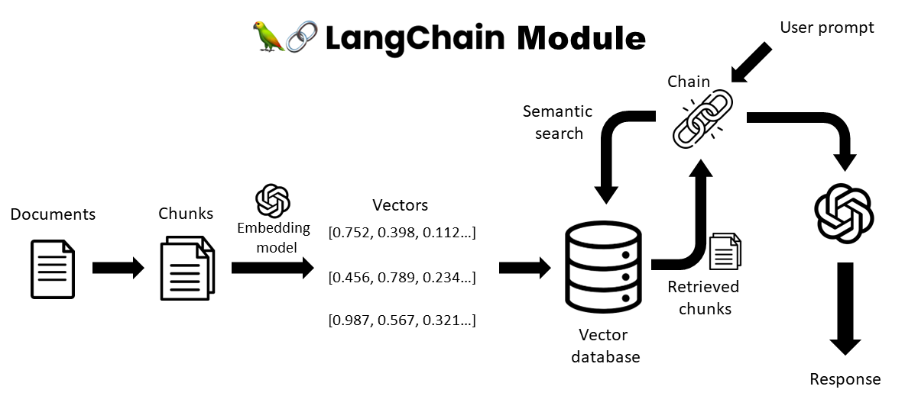

# Retrieval Augmented Generation (RAG) with LangChain and OpenAI
 
 

This project implements RAG using OpenAI's embedding models and LangChain's Python library. Areas include:
- Document splitting
- Embeddings (OpenAI)
- Vector database (Chroma / FAISS)
- Semantic search types
- Retrieval chain

## Upcoming works:
- Add logger
- Introduce conversation retriever and memory states

### 20231213 MVP3:
- refactored code to use tempfile to utilize langchain's loaders
- added functionality to allow srt files
- added webbaseloader and youtube loader
- added an option to use Wikipedia as the retriever instead
- added brief documentation
- added debug mode (exceptions will be raised)

### 20231210 updates:
- refactored to work on modules
- allowed for wikipedia query with RAG

### 20231207 updates:
- refactored to use yaml config file
- allowed for txt and docx files

### 20231203 updates:
- added status spinners
- updated tooltips

### 20231202 MVP2:
- Incorporated types of different query chains - restricted query, creative query
- Incorporated temperature settings
- Restructured functions to get functions
- Included explanations on the frontend and backend workings
- Included examples

### 20231201 Fixes and MVP1:
- chroma was changed to 0.3.29 for streamlit - did not work, reverted
- switched to FAISS vector db from Chroma db due to compatibility issues with Streamlit (sqlite versioning)
- removed pywin32 from library, streamlit is unable to install this dependency